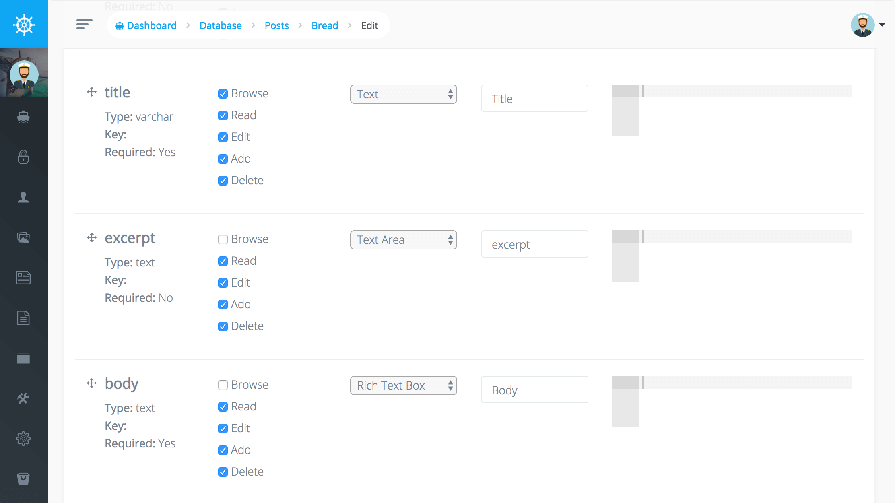
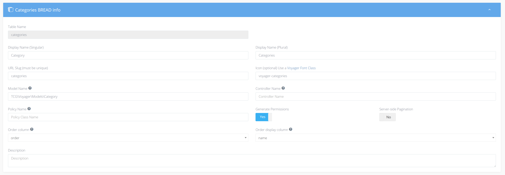
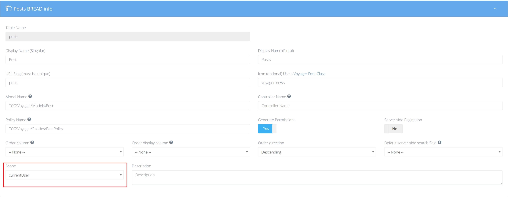

# BREAD Builder

When adding or editing the current BREAD for a database table you will first see the BREAD info which allows you to set the Display Names, slug, icon, `Model` and Controller Namespace, Policy Name. You can also choose if you would like to Generate permissions for that BREAD type.


When you scroll down you will see each of the rows that are associated with that table where you can select where in your views you want to see each of those fields:

* BROWSE \(field will show up when you browse the current data\)
* READ \(field will show when you click to view the current data\)
* EDIT \(field will be visible and allow you to edit the data\)
* ADD \(field will be visible when you choose to create a new data type\)
* DELETE \(doesn't pertain to delete so this can be checked or unchecked\)



You may also choose to specify what form type you want to use for each field. This can be a TextBox, TextArea, Checkbox, Image, and many other types of form elements.

Each field also has additional details or options that can be included. These types are checkbox, dropdown, radio button, and image.

## Validation

Inside of the _Optional Details_ section for each row in your BREAD you can also specify validation rules with some simple JSON. Here is an example of how to add a validation rule or _required_ and _max length of 12_

```php
{
    "validation": {
        "rule": "required|max:12"
    }
}
```

Additionally, you may wish to add some custom error messages which can be accomplished like so:

```php
{
    "validation": {
        "rule": "required|max:12",
        "messages": {
            "required": "This :attribute field is a must.",
            "max": "This :attribute field maximum :max."
        }
    }
}
```

You can also can define multiple rules the following way:

```php
{
    "validation": {
        "rule": [
            "required",
            "max:12"
        ]
    }
}
```

### Action specific rules
You can define separated validation rules for edit and add:
```
{
    "validation": {
        "rule": "required",
        "edit": {
            "rule": "sometimes|min:3"
        },
        "add": {
            "rule": "min:3"
        }
    }
}
```

You can find a list of all available validation rules in the [Laravel docs](https://laravel.com/docs/validation#available-validation-rules).

## Generating Slugs

Using the bread builder you may wish to automatically generate slugs of a certain input. Lets say you have some posts, which have a title and a slug. If you want to automatically generate the slug from the title attribute, you may include the following _Optional Details_:

```php
{
    "slugify": {
        "origin": "title",
        "forceUpdate": true
    }
}
```

This will automatically generate the slug from the input of the `title` field. If a slug does already exists, it will only be updated if `forceUpdate` is set enabled, by default this is disabled.

## Tagging

Tagging gives you the possibility to add new items to a Belongs-To-Many relationship directly when editing or adding a BREAD.

To activate this function, you simply have to enable `Tagging` in the relationship details


After that you can enter a free-text into the select and hit enter to save a new relationship.


**Be aware:**

This only stores the `display-column` so you have to make sure that all other fields are either nullable or have a default value.


## Null Values

You might want to save an input field into the database as a `null` value instead of an empty string.

Simply enough, inside the BREAD you can include the following _Optional Details_ for the field:

```php
{
    "null": ""
}
```

This will turn an empty string into a `null` value. However you might want to be able to add both an empty string and a `null` value to the database for that field. However you have to choose a replacement for the `null` value, but it can be anything you wish. For example, if you want a field to change a string \(ex. `Nothing`\) into a `null` value you could include the following _Optional Details_ for that field:

```php
{
    "null": "Nothing"
}
```

Now entering `Nothing` into the field will end up as a `null` value in the database.

## Display options

There are also a few options that you can include to change the way your BREAD is displayed. You can add a `display` key to your json object and change the width of the particular field and even specify a custom ID.

```php
{
    "display": {
        "width": "3",
        "id": "custom_id"
    }
}
```

The width is displayed on a 12-grid system. Setting it with a width of 3 will span 25% of the width.

The **id** will let you specify a custom id wrapper around your element. example:

```markup
<div id="custom_id">
    <!-- Your field element -->
</div>
```

## Ordering Bread Items

You can define the default order for browsing BREADs and order your BREAD items with drag-and-drop.  
For this you need to change the settings for your BREAD first:



**Order column** is the field in your table where the order is stored as an integer.  
**Order display column** is the field which is shown in the drag-drop list.  
**Order direction** the direction in which the field is ordered.

After this you can go to your BREAD-browse page and you will see a button **Order.**  
Clicking this button will bring you to the page where you can re-arrange your items:


## Scope browse-results

If you want to filter the browse results for a BREAD you can do so by creating a [Scope](https://laravel.com/docs/eloquent#local-scopes) in your model.
For example if you want to only show posts that were created by the current user, define a Scope like the following:
```php
<?php
public function scopeCurrentUser($query)
{
    return $query->where('author_id', Auth::user()->id);
}
```

Next, go to the BREAD-settings for `posts` and look for the `Scope` input and select `currentUser`:



After hitting `Submit` you will only see your own posts.
